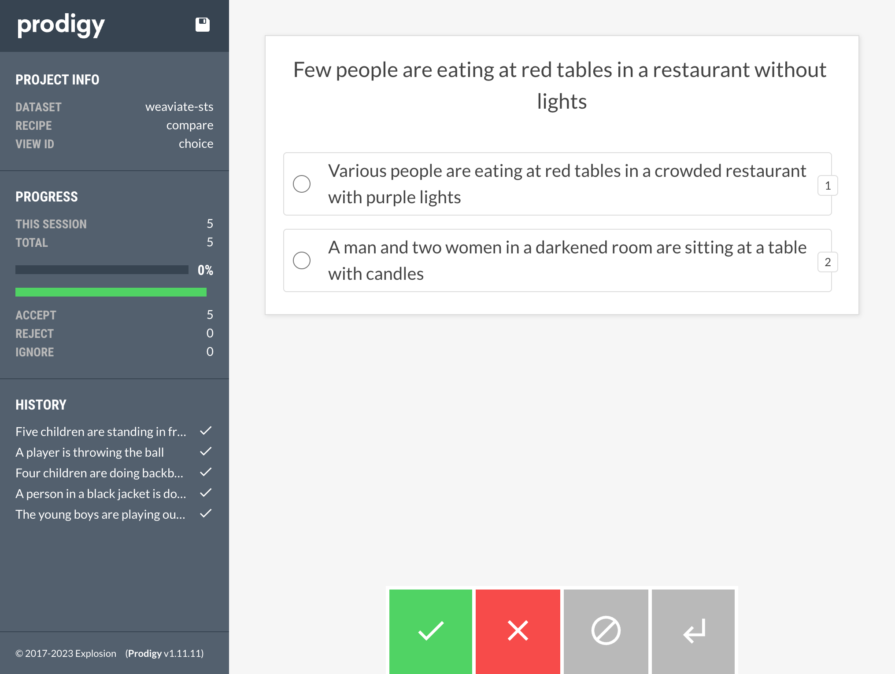

# Overview

A/B evaluation with Prodigy with weaviate vector database using OpenAI embeddings.

To install, first add `PRODIGY_KEY` and `OPENAI_KEY` to `.env` file.

Create a new virtual environment:

```
python -m venv venv
source venv/bin/activate
```

Run `make install` to install libraries.

Run `make get_data` to download sample text data.

# Weaviate

1. Create a [cloud instance](https://weaviate.io/developers/wcs/quickstart)

Using the free cloud instance for demo purposes. These are only available for 14 days.

My example includes authentication. This is optional but recommended for more realistic applications.

2. Add your cloud URL (`WEAVIATE_CLUSTER`) and Auth token (`WEAVIATE_TOKEN`) to .env file. Can create manuallly or programmatically:

```
dotenv set WEAVIATE_CLUSTER https://my-sandbox-cluster-xxxxxx.weaviate.network
dotenv set WEAVIATE_KEY xxxxxxxxxxxxxxxxxxxxxxxxxxxxxxx
```
3. Create [schema and upload data to cloud instance](https://weaviate.io/developers/weaviate/tutorials/schema)

```
make setup
```

To check, run `https://some-endpoint.weaviate.network/v1/objects` (will need authorization if provided).

4. Create A/B dataset by taking input data `sick-test.jsonl`, querying weaviate, and taking the top and 5th top choice:

```
make query
```

This will create two datasets: `data/choice_top.jsonl` (ranking #1) and `data/choice_bottom.jsonl` (ranking #5).

These two datasets will then be used as an A/B test, using the input text and masking which of the options is which (i.e., which is the top and which is the bottom choice).

If the model is consistent with the annotators preferences, we'd expect the top ranking to always be preferred over the bottom (5th) ranking. 

5. Run Prodigy's A/B (`compare`) recipe

```
make prodigy
```

This runs Prodigy's [`compare` recipe](https://prodi.gy/docs/recipes#compare):

```
python3 -m prodigy compare weaviate-sts ./data/choice_bottom.jsonl ./data/choice_top.jsonl
```



# TODOS

[ ] Generalize `query_weaviate.py` to take bottom ranking as input

[ ] Remove options that are identical to the input

[ ] Explore option to compare across different embeddings: e.g., OpenAI vs. Cohere or HuggingFace

[ ] Explore running local weaviate instance (e.g., Docker)

[ ] Create custom Prodigy recipe that reads weaviate in batches, rather than flat files

[ ] Create tests
